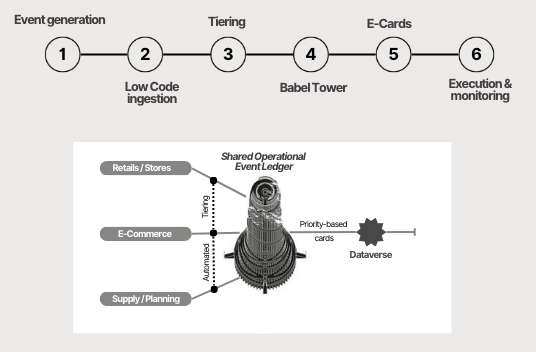

# 🗼 The Commercial Babel Tower  
### Operational Event Orchestration: *Turning events into shared decisions*

This business case explores how fragmented operational signals across retail, e-commerce and supply can be transformed into shared, prioritized decisions.

The Commercial Babel Tower proposes an **event-driven operating model** where operational actions are captured, translated into a common language, and surfaced through a shared backlog to accelerate execution and reduce noise across teams.

### Scope & Assumptions

- The scope focuses on **operational event orchestration**, not on enterprise-wide system replacement.
- The model assumes **heterogeneous source systems** across retail, e-commerce and supply.
- Tooling examples (Power Automate, Teams, ServiceNow) are **illustrative and non-prescriptive**.
- The operating model is designed for **incremental rollout**, starting with priority use cases.
- Governance, ownership and execution remain **locally embedded**, with shared visibility at group level.

---

## A. Business Context

Retail operations generate critical operational events every day across retail, e-commerce and supply functions.  
These events are produced in different systems, interpreted locally and escalated through unstructured channels.

The issue is not data availability, but the absence of a shared operational language that allows events to be prioritized, coordinated and acted upon consistently across teams.

### Current Challenges

- Fragmented operational signals across heterogeneous systems  
- Function-driven and subjective priority setting  
- Unstructured exception handling and manual escalations  
- Reporting-driven decision cycles  

### Impact on Operations

- Delayed reaction to demand and stock deviations  
- Misaligned priorities across operational teams  
- Overdependence on manual handoffs  
- Breakdown in decision-to-execution traceability  

---

## B. Business Solution

The Commercial Babel Tower proposes an **Operational Event Orchestration** approach that enables automated multi-source event ingestion, objective prioritization through tiering and centralized operational observability.

Operational events are captured at source using low-code automation, translated into a common signal format and prioritized through predefined scoring rules.  

Tiered events are consolidated into a shared operational backlog and surfaced through e-cards for daily triage and decision-making, with execution and traceability handled downstream when required.

The operating model is structured as a sequential flow from event generation to execution and review. Each phase serves a distinct operational purpose, with selected phases supported by dedicated artefacts for deeper inspection.

### B.1. Event Generation  
Operational events originate independently across:
- Retail / Stores  
- E-commerce  
- Supply & Planning  

These sources may include store-level actions, digital performance signals or planning deviations.
Each source operates with its own systems, timing and operational logic.

Given the heterogeneity of legacy systems, events are captured where they occur rather than forced into a single upstream platform.

---

### B.2. Low-Code Ingestion  
Operational events are automatically ingested using low-code automation (e.g. Power Automate), enabling:
- Multi-source ingestion  
- Event normalization  
- Metadata enrichment

This approach allows operational teams to surface events consistently while keeping system ownership local.

➡️ [Low-Code Event Ingestion](assets/logic/low-code-ingestion.md)
*(See supporting artefacts for detailed role definitions and interactions.)*  

---

### B.3. Event Scoring & Tiering  
Not all operational events require the same level of attention.
Each event is evaluated through a predefined scoring model based on:
- Impact  
- Urgency  
- Recurrence  

This scoring establishes priority tiers (High / Medium / Low), independent of the originating team, creating a shared operational language.

Tiering establishes a shared operational language, ensuring that prioritization is consistent across functions and independent of local interpretation.

➡️ [Event Scoring & Tiering Logic](assets/logic/event-scoring.md)
*(See supporting artefacts for detailed role definitions and interactions.)*  

---

### B.4. Shared Operational Event Ledger (Babel Tower)

Tiered events are consolidated and stored in a shared operational repository (e.g. Dataverse), acting as a single source of operational truth where:
- Each event exists once  
- Priority is consistent across teams  
- Ownership and status are explicit  
- Event history is preserved  

This ledger acts as the translation point between fragmented operational signals and shared decision-making inputs.

---

### B.5. Shared Attention & Decision (E-Cards)

Prioritized events are surfaced through priority-based e-cards in a shared operational channel (e.g. Microsoft Teams), enabling:
- Cross-team visibility  
- Daily triage and review  
- Coordinated decision-making  

Only relevant, tiered events are exposed, reducing operational noise.

➡️ [Shared Attention & Decision (E-Cards) Logic](assets/logic/e-cards.md)
*(See supporting artefacts for detailed role definitions and interactions.)* 

---

### B.6. Execution, Monitoring & Review

When formal execution or traceability is required:
- Actions are executed and tracked via ServiceNow or equivalent systems  
- Event status is synchronized back to the operational ledger  

Events remain revisitable, monitorable and exportable for HQ review, monitoring and continuous improvement.

---

## C. Effectiveness Metrics
The effectiveness of the Commercial Babel Tower operating model is assessed through execution-oriented metrics focused on signal quality, prioritization accuracy and speed of operational response.

Rather than measuring reporting volume or tool adoption, these metrics track how quickly operational events are surfaced, how consistently they are prioritized, and how effectively teams act on shared signals across retail, e-commerce and supply.

- Event-to-decision latency  
- Priority accuracy  
- Escalation rate  
- Resolution cycle time  
- Recurring event patterns  

➡️ [Effectiveness Metrics – Commercial Babel Tower](assets/metrics/effectiveness-metrics.md)
*(See supporting artefacts for detailed role definitions and interactions.)* 

---

### D. Artefacts

This business case includes:

- Commercial Babel Tower snapshot slide (PDF)
- Low-Code Event Ingestion (Power Automate) definition and example 
- Event Scoring & Tiering Logic definition
- E-Cards & Shared Operational Backlog illustration
- Babel Effectiveness Metrics
  
Each artefact is designed to be modular and tool-agnostic, enabling adaptation to different retail operating contexts.

---

### E. Impact Summary – Before vs After

The table below summarizes the expected operational impact of the Commercial Babel Tower once implemented, highlighting how signal handling, prioritization and execution improve across retail, e-commerce and supply functions.

| Dimension | Before Babel Tower | After Babel Tower |
|---------|--------------------|-------------------|
| Operational signals | Fragmented across systems and teams | Captured as standardized operational events |
| Event visibility | Delayed and role-dependent | Near real-time, role-aware visibility |
| Prioritization | Subjective and function-driven | Objective, scoring-based tiering |
| Reaction time | Slow, driven by manual escalation | Reduced through automated ingestion and triage |
| Cross-team coordination | Ad-hoc, informal handoffs | Shared operational backlog and e-cards |
| Escalation behaviour | Excessive ticket creation | Selective escalation based on priority |
| Traceability | Limited or inconsistent | End-to-end event traceability |
| Operational posture | Reactive | Anticipatory and data-driven |

These improvements are measured and monitored through the babel effectiveness KPIs defined in the supporting artefacts.

---

## F. Why This Matters

The Commercial Babel Tower does not centralize decisions or replace existing systems.  
It centralizes operational relevance, priority and timing, enabling coordinated execution while preserving local ownership.

---

## Notes
- Tools mentioned are illustrative  
- The value lies in the operating model, not the technology stack  
- The approach scales from fragmented environments to mature, ticket-driven operations  
