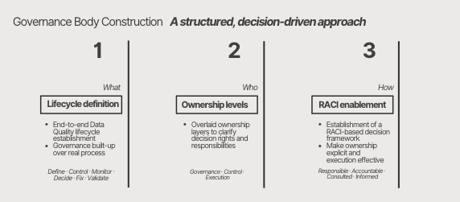

# 02. Governance Operating Model  
### Decision-Driven Data Governance Framework

This business case presents a **data governance operating model** designed to clarify decision ownership, enable execution and improve data quality outcomes across complex organizations.
It is particularly relevant for complex, regulated organizations where data decisions cut across business and technology.

The model focuses on **how data-related decisions are made and executed**, rather than on governance as a purely policy-driven exercise.

### Scope & Assumptions

- This operating model focuses on clarifying decision ownership and execution
  across complex, cross-functional processes.
- The model assumes distributed ownership across domains, coordinated through
  a shared governance and prioritization framework.
- Solutions, tools and platforms are intentionally abstracted to keep the focus
  on roles, decision rights and operational execution rather than implementation specifics.

---

## A. Business Context

Organizations operating with advanced data and analytics capabilities often face recurring challenges:

- Unclear data ownership  
- Overlapping roles between business and technology  
- Data Quality issues without a clear resolution path  
- Governance perceived as bureaucracy rather than value  

These challenges typically lead to low trust in KPIs, slow issue resolution, friction between stakeholders and inefficient use of data assets.

---

## B. Business Solution

A **practical data governance framework** defining **decision ownership across the data–business lifecycle**, built to translate governance principles into operational execution.

The model is structured as a **governance body framework**, combining lifecycle definition, ownership layers and decision enablement mechanisms.

And this is how the **Governance Operating Model** would be implemented:

- Start with a limited set of critical data elements (KDEs)
- Roll out roles and RACI progressively, prioritizing high-impact processes
- Introduce KPIs early to track adoption and execution effectiveness

---

## B.1. Governance Architecture  
### Three Layers. One Flow.

The governance architecture is organized into three complementary layers:

- **Governance Layer** – Direction and accountability  
- **Control Layer** – Ownership and prioritization  
- **Execution Layer** – Delivery and feedback  

These layers work together to ensure alignment between strategic intent, decision-making and operational execution.

---

## B.2. Governance Body Construction  
### A structured, decision-driven approach

The governance body is constructed through three sequential steps.

---

### 1. Lifecycle Definition *(What)*

Definition of an **end-to-end Data Quality lifecycle**, establishing how data-related work flows from definition to resolution.

This lifecycle provides a shared operational reference across business and technology teams and anchors governance on real processes.

**Lifecycle phases**  
Define · Control · Monitor · Decide · Fix · Validate  

---

### 2. Ownership Levels *(Who)*

Ownership is structured across three distinct layers to clearly separate
**strategic accountability, domain ownership and execution responsibilities**
across the data lifecycle.

This layered ownership model is designed to eliminate role overlap between
business and technology, while ensuring continuity from decision-making
to operational delivery.

#### Ownership layers

**Governance Layer – Strategic accountability**  
Provides direction and accountability for data governance across the organization.
This layer owns data quality strategy, standards, prioritization principles
and escalation paths, ensuring alignment with business objectives and regulatory
requirements.

**Control Layer – Domain ownership & prioritization**  
Owns data domains and data quality outcomes within a business context.
This layer translates strategic direction into domain-level decisions,
priorities and ownership, acting as the bridge between governance intent
and execution.

**Execution Layer – Operational delivery**  
Responsible for executing data quality activities, including monitoring,
controls implementation and issue remediation.
This layer ensures decisions are translated into concrete actions
across systems and processes.

---

### Roles aligned to ownership layers

Ownership is operationalized through a defined set of **data governance roles**,
distributed across the three layers to balance accountability, decision-making
and execution across data production and data consumption.

The roles model provides the structural foundation upon which
the RACI decision framework is applied in Step 3.

➡️ [Governance Roles Model (visual)](./assets/roles/roles-and-responsibilities.md)
*(See supporting artefacts for detailed role definitions and interactions.)*  

---

### 3. RACI Enablement *(How)*

Establishment of a **RACI-based decision framework** to operationalize the Governance Operating Model
by explicitly defining execution responsibilities and decision ownership
across the data lifecycle.

RACI clarifies roles:
- who executes activities - Responsible (R)
- who owns decisions and outcomes - Accountable (A)
- who must be consulted before decisions are made - Consulted (C)
- who requires visibility on progress and results - Informed (I)

By applying RACI to key data quality activities, the model:
- eliminates ownership ambiguity
- ensures a single accountable owner per decision
- accelerates issue resolution
- enables governance to operate as an execution framework rather than a policy layer

RACI is applied to lifecycle steps covering both one-off validations
and business-as-usual (BAU) data quality activities.
RACI clarifies who executes, who owns the outcome, who provides input and who requires visibility across each phase of the data lifecycle. 

➡️ [RACI Matrix – Data Quality Governance](./assets/raci/raci-matrix.md)
*(See supporting artefacts for detailed role definitions and interactions.)*

---

## C. Effectiveness Metrics  
### Governance & Operational KPIs

The effectiveness of the governance model is measured through governance and operational KPIs, including:

- Decision ownership clarity  
- Time to issue resolution  
- Reduction of recurring data quality issues  
- Improvement in KPI trust and adoption  

➡️ [Governance Effectiveness Metrics](./assets/metrics/governance-effectiveness-kpis.md)
*(See supporting artefacts for detailed role definitions and interactions.)*

---

## D. Artefacts

This business case includes:
- Governance Operating Model snapshot slide (PDF)  
- Data Quality lifecycle definition  
- Ownership layers and role definitions  
- RACI decision matrix  
- Governance effectiveness metrics  

---

## E. Impact Summary – Before vs After

The table below summarizes the expected impact of the Governance Operating Model
once implemented, highlighting how decision-making, execution and trust improve
across the organization.

| Dimension                     | Before Governance Model                | After Governance Model                     |
|------------------------------|----------------------------------------|--------------------------------------------|
| Decision ownership           | Unclear or shared accountability       | Single accountable owner per decision      |
| Issue resolution speed       | Slow, escalations frequent             | Faster resolution with clear ownership    |
| Decision lead time           | High and inconsistent                  | Reduced and predictable                   |
| Role clarity                 | Overlapping business & tech roles      | Clear separation of roles and responsibilities |
| Data Quality issues          | Reactive and recurring                 | Proactive detection and root-cause fixes  |
| KPI reliability              | Low trust in reported figures          | Trusted, governed business KPIs           |
| Governance perception        | Bureaucratic, compliance-driven        | Decision-driven, execution-oriented       |
| Business–Tech collaboration  | Friction and misalignment              | Structured collaboration via RACI         |

These improvements are measured and monitored through the governance
effectiveness KPIs defined in the supporting artefacts.

---

## F. Why This Matters

This operating model reframes data governance as a **decision enablement system**, creating a scalable foundation for data, analytics and AI adoption.
