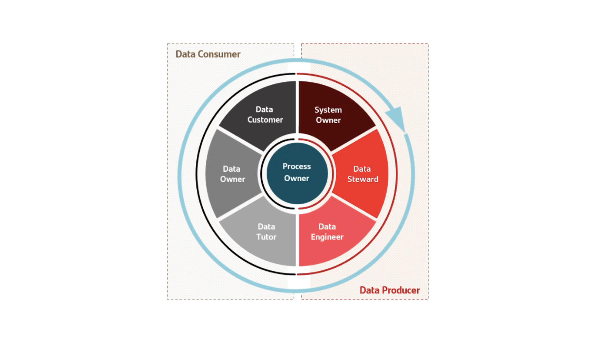

# Governance Roles & Responsibilities

This document details the roles supporting the Governance Operating Model.
Roles are structured according to the established ownership layers:
Governance, Control and Execution.

The objective is to clarify accountability, decision rights and execution
responsibilities across the data lifecycle.

### Governance Layer – Strategic Accountability

Defines enterprise-level direction, standards and accountability for
data governance, ensuring alignment with business strategy and regulatory
expectations.

### Control Layer – Domain Ownership & Prioritization

Owns data domains and data quality outcomes within a business context,
translating governance direction into domain-level decisions and priorities.

### Execution Layer – Operational Delivery

Executes data quality controls, monitoring and remediation activities,
ensuring decisions are translated into operational actions across systems.

## Governance Roles Model (Visual)

This visual illustrates how governance roles are distributed across
the ownership layers and how responsibilities span data production
and data consumption across the data lifecycle.

The inner layer represents the **process-centric ownership**, ensuring
continuity and accountability across the end-to-end data lifecycle.
Surrounding roles contribute from either a data producer or data consumer
perspective, depending on where data is created, transformed or used.

By structuring roles in this way, the model:
- Clarifies accountability without centralizing execution  
- Avoids role overlap between business and technology  
- Ensures governance is embedded into operational processes  
- Creates a clear foundation for decision ownership and RACI mapping

## Role Descriptions

### Governance Layer

**Chief Data & AI Officer**

- Accountable for the enterprise data governance and data quality strategy  
- Defines standards, methodologies and operating principles across data domains  
- Owns prioritization criteria, escalation paths and governance decision forums  
- Ensures alignment between data governance, business strategy and regulatory requirements  
- Acts as sponsor of the data quality culture and adoption across the organization

### Control Layer

**Data Owner**

- Accountable for data quality, definition and usage within a specific business domain  
- Owns business meaning, criticality and key data definitions  
- Prioritizes data quality issues and approves remediation approaches  
- Balances business value, risk and compliance considerations  
- Delegates operational execution while retaining accountability for outcomes
  
**Process Owner**

- Owns end-to-end business processes generating or consuming data  
- Defines data requirements and quality expectations from a process perspective  
- Acts as main decision-maker for trade-offs impacting process performance  
- Ensures data governance is embedded into operational workflows  
- Escalates structural issues impacting data quality or execution capacity

  ### Execution Layer

**Data Steward**

- Operational owner of data quality rules, controls and validations within a domain  
- Monitors data quality indicators and identifies issues and anomalies  
- Coordinates issue analysis and remediation with technical and business teams  
- Maintains metadata, data quality logs and operational documentation  
- Acts as first line of execution for data quality governance

**Data Engineer**

- Designs, implements and maintains data pipelines and data models  
- Translates functional data quality rules into technical controls and validations  
- Implements fixes at source or transformation level to resolve data issues  
- Ensures scalability, performance and reliability of data processing  
- Collaborates closely with Data Stewards to automate and industrialize controls

**System Owner**

- Owns the technical platforms and systems hosting data assets  
- Ensures system availability, security and operational stability  
- Supports implementation of data quality controls within systems  
- Coordinates with Data Engineers and Process Owners on system-level changes

Together, these roles enable a clear separation between accountability,
decision-making and execution, while ensuring continuous feedback
across governance, control and execution layers.
