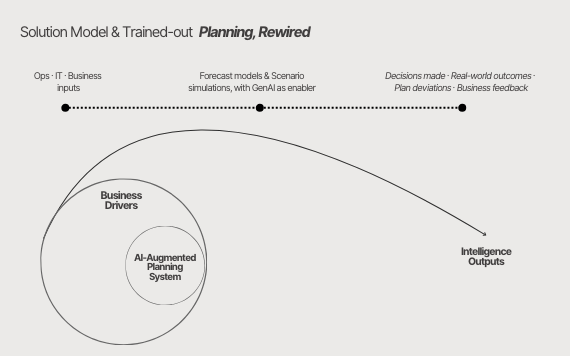

# 03. AI-Driven Planning & Forecast

In volatile and fast-moving contexts, planning often fails not because of lack of data, but because it struggles to keep up with decision-making. 

Based on first-hand experience across complex, multi-stakeholder environments, this business case reflects how planning and forecasting actually operate under real-world constraints. Rather than promoting a specific technology or vendor, it captures practical patterns observed in how organizations test assumptions, navigate uncertainty and support executive decision-making when conditions change faster than planning cycles.

The focus is on translating that empirical understanding into an AI-enabled planning model that strengthens scenario exploration, insight generation and decision confidence, without over-engineering or theoretical abstraction. 

In other words, to make the most of both existing capabilities and the future AI-enabled workforce.

### Scope & Assumptions

- The scope focuses on **planning intelligence and scenario-based decision support**, not on re-engineering forecasting methodologies
- The approach assumes **existing planning cycles, ownership and FP&A foundations** are already established
- AI is used to **surface signals, compare scenarios and generate executive-level intelligence**, not to replace judgment
- Tooling **references** are derived **from empirical exposure** to common enterprise stacks, but remaining vendor-agnostic 
- The model is designed for **progressive practical adoption**, under real constraints, integrating into existing planning rituals rather than creating parallel processes.

---

## A. Business Problem

Increased investment in data and analytics has led many organizations to **struggle with harmonisation and effective downstream use**. Forecasts and plans often coexist in multiple versions across multiple channels, shaped by different assumptions, ownership models and time horizons.

As a result, planning becomes highly manual, increasing operational risk associated with human intervention. This makes it difficult to test strategic choices in a consistent and trustworthy way. Scenarios are produced, but rarely recalculated at the pace decisions require, and executive teams frequently rely on parallel analyses or intuition when navigating trade-offs.

The core problem is not the absence of information, but the lack of an integrating model that consistently converts business drivers and assumptions into timely, decision-ready intelligence.

### Current Challenges

- Fragmented planning cycles and multiple, inconsistent forecast versions
- Limited transparency on key drivers, resulting in low executive trust in forecasting outputs
- Slow scenario recalculation in rapidly changing contexts  

### Impact on the Organization

- Strategic decisions delayed or taken based on outdated insights
- Inefficient capital allocation  
- Planning perceived as reporting, not decision enabler  

---

## B. Business Solution

An **AI-augmented planning system** that continuously updates forecasts, simulates scenarios and transforms business drivers into executive-ready intelligence outputs.

Rather than replacing existing planning processes, the solution overlays AI capabilities to structure assumptions, accelerate scenario analysis and translate planning outputs into decision-ready intelligence. The focus is not on predictive sophistication, but on enabling faster, clearer and more trusted decisions across planning cycles.

The model connects business drivers, planning inputs and real-world feedback from heterogeneal teams through a single planning system, ensuring that forecasts and scenarios evolve at the same pace as strategic decisions.

---

### B.1. Solution Model — Planning, Rewired

The model is structured as a continuous intelligence loop:

- Business drivers and planning inputs are made explicit  
- Forecast and scenario models test strategic options  
- A GenAI layer synthesizes results into decision intelligence outputs  
- Real-world outcomes and business feedback continuously refine assumptions  

The objective is not higher predictive accuracy alone, but faster and more confident decisions grounded in transparent trade-offs.

---

### B.2. Tooling & Implementation Approach

The solution is designed to be lightweight, modular and enterprise-ready:

- **Forecast & Scenario Engine**  
  Python, SQL and existing FP&A models  

- **GenAI Narrative Layer**  
  GPT-based LLMs (e.g. OpenAI API) for synthesis and executive narratives  

- **Reporting & Delivery Layer**  
  Power BI / Tableau, Notion and executive-ready PDFs or slides  

---

## B.3. Roll-out Timeline

Implementation follows an adoption-led, phased approach:

- **Weeks 1–3**  
  Planning foundations, business driver alignment and baseline models  

- **Weeks 4–7**  
  Scenario simulation and GenAI intelligence layer integration  

- **Weeks 8–12**  
  Executive adoption, governance and iteration  

---

## C. Effectiveness Metrics

- Forecast accuracy improvement  
- Reduction in planning cycle time  
- Time-to-decision reduction  
- Executive confidence in planning outputs  

---

## D. Artefacts

This business case includes:

---

## E. Impact Summary – Before vs After

---

## F. Why This Matters

- AI augments judgment, it does not replace it  
- Planning becomes a continuous intelligence capability  
- Decision quality improves through clarity, not complexity  
