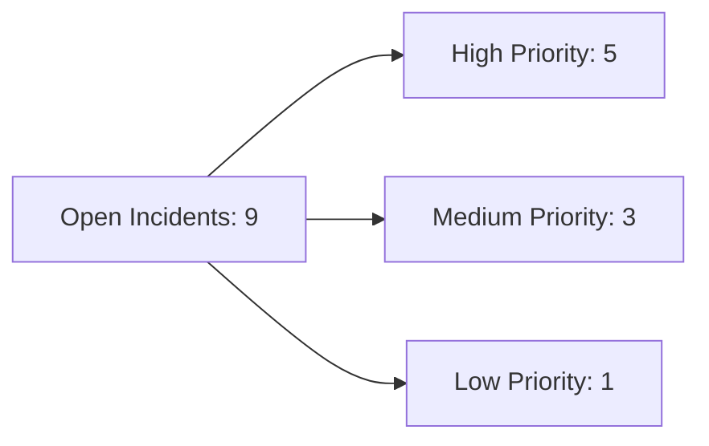
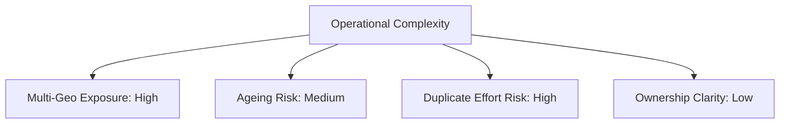

# Executive Intelligence Summary
_Applied Example — Operational Incident Backlog_

_Last updated through AI-enabled interpretation._

---

## Executive Intelligence Dashboard

### Backlog Pressure

----

### Coordination & Complexity Signals

 ----
 
### Continuous Intelligence Loop

---

# Executive Intelligence Summary
_Applied Example — Operational Backlog_

## What is happening
- The operational backlog shows sustained pressure, with a high share of open and high-priority incidents.
- Average ageing indicates that several issues remain unresolved beyond expected planning cycles.
- More than half of active incidents affect multiple geographies, increasing coordination complexity.

## Why it matters
- Operational friction is no longer localised and requires cross-country alignment.
- Tactical fixes are absorbing capacity while underlying structural issues persist.
- Duplicate incidents suggest duplicated effort and fragmented ownership.

## Where attention is needed
- Clarify ownership for cross-geo incidents to avoid parallel resolution paths.
- Distinguish tactical containment from strategic remediation.
- Reassess backlog prioritisation criteria in light of ageing and impact.

---

*This summary is generated from structured signals and interpreted through an AI-enabled narrative layer.
It supports discussion and prioritisation, not automated decision-making.*

