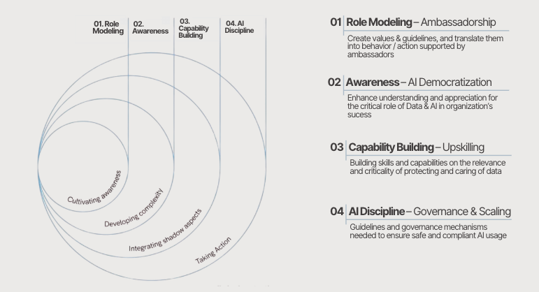

# ⚙️ AI Champions Flywheel  
### AI Adoption Model: *From players to champions*

This business case explores how organizations can move from fragmented AI usage to structured, scalable adoption embedded into day-to-day business workflows.

While AI adoption remains uneven, use cases isolated, and impact limited, the AI Champions Flywheel introduces a **structured model to activate adoption across business teams**, combining enablement, community and governance to turn AI into a core capability.

### Scope & Assumptions  

- Focus on **AI adoption and enablement**, not model development or infrastructure  
- Assumes **availability of AI tools** (e.g. Copilot, automation tools, internal agents)  
- Designed for organizations with **distributed teams and varying levels of AI maturity**  
- Emphasis on **behavioral change** and operating model, not tooling selection  

---

## A. Business Context  

Organizations are increasingly investing in AI tools to enhance productivity and decision-making. However, the value of these investments depends not on tool availability, but on their effective adoption within daily business operations.

In many cases, AI remains underutilized due to a lack of integration into workflows, limited understanding of practical use cases, and absence of structured enablement mechanisms.

This creates a gap between AI potential and realized impact, where tools exist but are not consistently embedded into how teams work, collaborate and make decisions.

### Current Challenges  

- Limited AI adoption in daily work  
- Lack of integration into business workflows  
- Fragmented experimentation across teams  
- AI perceived as a technical initiative rather than a business capability  

### Impact on the Organization

- Untapped AI productivity gains  
- Slow discovery of high-value use cases  
- Uneven adoption across teams  
- Low trust in AI-driven decisions  

---

## B. Business Solution  

The core challenge is not access to AI, but the absence of a system that translates it into consistent, repeatable usage across teams.

The **AI Champions Flywheel** addresses this by shifting AI from a tool-based initiative to an embedded business capability, activated through structured enablement, peer-driven adoption and lightweight governance.

Instead of relying on top-down deployment, the model distributes ownership across the organization, enabling teams to progressively integrate AI into their workflows while maintaining alignment and control.

---

### B.1. Flywheel Pillars 

The model is built around four complementary pillars, each targeting a critical adoption barrier:

**01. Role Modelling — Ambassadorship**  

Adoption starts locally: at the team level. This pillar establishes a distributed network of AI champions acting as role models, responsible for translating AI into tangible behaviors and business impact.

AI Champions are not only early adopters, but **visible references of how AI should be used** within their domain, reinforcing best practices and accelerating adoption through proximity.

**02. Awareness — AI Democratization**  
AI adoption does not scale through tools, but through shared understanding. This pillar builds the narrative, visibility and cultural alignment required to position AI as a core business capability.

By making use cases visible, relatable and repeatable, it transforms isolated experimentation into collective momentum, enabling adoption to extend beyond early adopters and into the broader organization through internal campaigns, leadership storytelling and shared narratives.  

**03. Capability Building — Upskilling**  
Build role-based AI capabilities through practical training, real use cases and continuous support, enabling employees to confidently integrate AI into their daily workflows. The target is to ensure a transition from occasional usage to **consistent, value-generating** adoption.

The approach combines: 
- **Foundational training** for all employees
- **Role-specific enablement**
- **Hands-on application**, supported by:
  - Reusable assets: prompts, workflows, guides and playbooks
  - Ongoing support mechanisms (office hours, champions)

**04. AI Discipline — Governance & Scaling**  
To scale AI effectively, adoption must be supported by clear structure and accountability. This pillar embeds lightweight governance into business operations, ensuring that AI usage evolves from isolated initiatives into a consistent and reliable capability.

AI is integrated into core processes and strategic initiatives from the outset, with defined ownership across business and data roles. Use cases are assessed based on **value, risk and scalability**, complemented by **structured risk classification** aligned with emerging regulatory frameworks such as the EU AI Act.

This includes evaluating AI systems based on their **level of risk** and applying appropriate controls, ensuring responsible deployment and compliance from early stages. In this context, certified methodologies (e.g. *Ethical AI Assessment Frameworks*) can be leveraged to standardize evaluation and decision-making.

Clear guidelines further ensure responsible usage and proper escalation when needed, enabling AI to scale in a controlled, compliant and business-aligned way across the organization.

---

### B2. Flywheel Dynamics  

The effectiveness of the model lies not in each pillar individually, but in how they reinforce each other over time. This dynamic enables AI to transition from isolated experimentation to a sustained, organization-wide capability.

It operates as a self-reinforcing loop: 

Usage → Visibility → Demand → Capability → Impact
   ↑                                         ↓
   └─────────────────────────────────────────┘

Where:

- **Usage** generates tangible examples within teams, initiated through role modelling, where AI Champions translate capabilities into real use cases within their teams  
     
- **Visibility** builds awareness and trust across the organization    
     
- **Demand** increases as more teams seek to replicate value in daily practices, driving engagement in capability building initiatives   
  
- **Capability** develops through training and hands-on application. Employees progressively develop the skills and confidence required to integrate AI into their daily workflows
    
- **Impact** reinforces adoption and feedback into new usage, reinforced and scaled through governance mechanisms, ensuring consistency, alignment and risk control

The result is a transition from isolated experimentation to a sustained, organization-wide adoption of AI as a core operational capability.

---

## C. Behavioral Activation Layer  

To ensure AI adoption translates into real impact, the model is reinforced through three **behavioral principles** that guide how AI is understood, shared and operationalized across the organization.

These principles are not conceptual statements, but **practical lenses** that shape day-to-day decisions and actions.

---

### C.1. AI is your Business  

AI is treated as a core component of **how work gets done**, not as an external or optional capability.

Employees are encouraged to understand how AI impacts their domain, identify where it adds value, and ensure its responsible usage within their workflows.

In practice, this means:
- Understanding how AI influences decisions within and across domains  
- Embedding AI into daily tasks and operational processes  
- Applying principles of responsible usage: data integrity, validation, security   

---

### C.2. Voice the AI  

Adoption scales when **knowledge is shared and made visible**.

Teams actively communicate how AI is used, what works, and what doesn’t, creating a shared learning environment that reinforces best practices and builds trust.

In practice, this means:
- Sharing use cases, learnings and outcomes across teams  
- Reinforcing key principles through communication and leadership messaging  
- Promoting transparency on challenges and best practices  
- Contributing to a culture where decisions are increasingly AI-supported  

---

### C.3. Act on AI  

AI only creates value when it is embedded into action and **decision-making**.

Teams are encouraged to move beyond experimentation, integrating AI into processes, scaling successful use cases and improving how work is executed.

In practice, this means:
- Applying AI to concrete business decisions and workflows  
- Taking ownership of AI initiatives within each domain  
- Integrating AI tools into existing processes and systems  
- Driving continuous improvement through iteration and scaling  

---

Together, these behaviors ensure that AI is not only adopted, but continuously reinforced through everyday actions, enabling sustained impact across the organization.

---

## D. Implementation Approach  

The rollout of the AI Champions Flywheel follows a phased approach, progressively activating the model while building momentum and ensuring sustainable adoption across the organization.

---

### Timeline Overview  

Weeks 0–4        Weeks 5–12                 Weeks 13+  
┌──────────────┐ ┌──────────────────────┐ ┌────────────────────────┐
│ Activation   │→│ Enablement           │→│ Scaling                │
└──────────────┘ └──────────────────────┘ └────────────────────────┘

• Champions onboarding        • Role-based training        • AI embedded in workflows  
• Awareness campaigns         • Workshops & simulations    • Use cases scaled  
• Leadership alignment        • Office hours               • Governance reinforced  
• Initial use cases           • Community activation       • Community expansion  

### Phase 01 — Activation (Weeks 0–4)

**Objective**  
Establish the foundations for AI adoption and generate initial organizational momentum  

**Key Actions**  
- Set up Microsoft Teams structure and SharePoint knowledge base  
- Identify and onboard AI Champions across domains and seniorities  
- Launch awareness campaign (internal channels, demos, communications)  
- Secure leadership endorsement (townhalls, internal talks)  
- Define priority use cases and initial AI usage guidelines  

**Outputs**  
- Active AI Champions network  
- Initial use cases identified  
- Organization-wide awareness initiated  
- Foundational governance principles defined  

---

### Phase 02 — Enablement (Weeks 5–12)

**Objective**  
Build capabilities and enable teams to integrate AI into their daily workflows  

**Key Actions**  
- Deliver mandatory baseline training for all employees  
- Launch role-based training programs aligned with business functions  
- Run hands-on workshops and simulations based on real use cases  
- Activate office hours and continuous support channels  
- Share early use cases through demos and internal storytelling  
- Introduce engagement formats (AI sessions, knowledge sharing, internal talks)  

**Outputs**  
- Increased AI usage across teams  
- Employees equipped with practical AI skills  
- Initial validated use cases  
- Growing community engagement and knowledge sharing  

---

### Phase 03 — Scaling (Weeks 13+)

**Objective**  
Embed AI into core operations and scale adoption across the organization  

**Key Actions**  
- Integrate AI into business processes and workflows  
- Scale validated use cases across domains  
- Reinforce governance (risk assessment, monitoring, escalation)  
- Expand AI Champions network and community engagement  
- Establish recurring forums (e.g. quarterly AI Champions sessions)  

**Outputs**  
- AI embedded into day-to-day operations  
- Scalable and standardized use cases  
- Strengthened governance and risk control  
- Sustainable and self-reinforcing adoption  

---

### Operating Environment

The model is embedded within a Microsoft Teams-centered ecosystem:

- Teams as collaboration and activation hub (channels, workshops, office hours)  
- SharePoint as knowledge base (documentation, use cases, assets)  

Supporting tools include:

- Data Catalogs (Informatica / Collibra) for data visibility and ownership  
- AI Risk Assessment tools (e.g. OXETHICA) aligned with EU AI Act requirements  
- Model development platforms (e.g. Databricks / ML platforms)  
- Collaboration and communication tools (Teams + SharePoint)  

---

### Disclaimer

While this implementation is illustrated within a Microsoft Teams ecosystem, the model is technology-agnostic and can be adapted to other environments (e.g. Slack, Google Workspace or internal platforms), provided that collaboration, visibility and structured enablement are maintained.

---

## E. Effectiveness Metrics  

The effectiveness of the AI Champions Flywheel is measured through **adoption, capability building and governance KPIs**.  

Rather than focusing on isolated tool usage, the metrics below evaluate whether AI is successfully embedded into daily operations, improving productivity, decision-making and organizational learning.  

- AI adoption rate across teams  
- Usage of AI tools (e.g. Copilot, automations, agents)  
- Engagement in training sessions and community activities  
- Number of use cases identified, shared and scaled  
- Productivity gains (time saved, reduction of manual tasks)  
- Time-to-decision improvement in AI-supported workflows  
- % of use cases assessed under AI risk and governance frameworks  
- Trust in AI outputs and reduction of shadow AI usage  

➡️ AI Champions Effectiveness Metrics *(See supporting artefacts for KPI definitions and tracking framework.)*  

---

## F. Artefacts  
This business case includes:  

- AI Champions Flywheel overview (portfolio slide)  
- AI adoption journey and flywheel model diagram  
- AI Champions role definition and engagement model  
- Awareness campaign framework (channels, content and formats)  
- Training and enablement structure (baseline + role-based programs)  
- AI use case identification and scaling approach  
- Governance guidelines aligned with EU AI Act (risk classification and assessment)  
- AI risk assessment templates (OXETHICA methodology)  
- Community operating model (Teams + SharePoint structure)  
- KPI tracking framework for adoption, impact and governance

---

## E. Impact Summary – Before vs After  

The table below summarizes the expected impact of the AI Champions Flywheel once implemented, highlighting how AI adoption, capability building and governance improve across the organization.  

| Dimension                  | Before AI Adoption                          | After AI Champions Flywheel                          |
|--------------------------|---------------------------------------------|------------------------------------------------------|
| AI usage                 | Sporadic, individual experimentation        | Structured and embedded in daily workflows           |
| Use case discovery       | Ad-hoc and slow                             | Continuous, community-driven identification          |
| Capability building      | Fragmented and inconsistent                 | Structured training and role-based enablement        |
| Time-to-value            | Long experimentation cycles                 | Faster deployment and scaling of use cases           |
| Collaboration            | Siloed across teams                         | Cross-functional sharing through community           |
| Decision-making          | Limited AI support                          | AI-augmented, faster and more consistent             |
| Governance               | Unclear usage and risks                     | Defined frameworks and risk assessment processes     |
| Trust in AI              | Low and inconsistent                        | Increased trust through visibility and governance    |
| Scaling of initiatives   | Isolated pilots                             | Repeatable and scalable use cases                    |

These improvements are monitored through adoption, capability, impact and governance KPIs, ensuring that AI becomes a sustained organizational capability rather than a set of isolated experiments.  

---

## F. Why This Matters  

- AI shifts from experimentation to an operational capability embedded in daily work  
- Adoption becomes a structured journey, not an individual effort  
- Organizations move from isolated use cases to scalable impact  
- Governance ensures safe, compliant and trusted AI usage  
- Decision-making improves through accessibility, speed and shared understanding  

