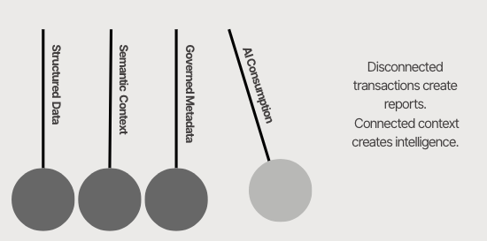

# 🧠 05. The Context Engine
### Semantic Foundations for Enterprise Data: Becoming AI-Ready

The Context Engine explores how **fragmented, siloed and semantically inconsistent enterprise datasets can be transformed** into contextualized intelligence layers that improve AI consumption, interoperability and explainability across business domains.

The operating model proposes a **progressive contextual architecture** where raw enterprise data is structured, connected and governed through semantic relationships, metadata layers and lineage mechanisms before being consumed by AI systems.

Rather than focusing on AI models themselves, the approach focuses on the contextual foundations required for scalable and trustworthy enterprise AI adoption.

## Scope & Assumptions

- It focuses on contextual data enablement for enterprise AI systems, not on model training or LLM fine-tuning
- The model assumes heterogeneous enterprise environments across retail, operations, customer and commercial domains
- Data structures, semantic layers and governance mechanisms are illustrative and technology-agnostic
- The operating approach is designed for progressive implementation through contextual maturity layers
- Governance, ownership and traceability remain distributed across domains while connected through shared metadata and lineage structures

---

## A. Business Context

Enterprise organizations generate massive amounts of **structured and unstructured data** across commercial, operational and customer systems every day. However, most of this information remains **fragmented across siloed environments, inconsistent business definitions and duplicated flat-table structures** originally designed for reporting rather than AI consumption.

While traditional analytics workflows can tolerate partial inconsistencies, AI systems require contextual understanding across entities, relationships, lineage and business meaning in order to produce reliable and explainable outputs.

### Current Challenges

- Fragmented raw data distributed across disconnected systems
- Flat-table structures with duplicated and inconsistent entity definitions
- Missing semantic relationships across enterprise domains
- Limited metadata standardization and lineage visibility
- Weak explainability across transformations and AI outputs
- Low interoperability between business and data-driven initiatives

---

## B. Business Solution

The Context Engine introduces a contextual architecture framework that **progressively transforms fragmented enterprise data into AI-ready intelligence** through four interconnected maturity layers:

1. Structured Data
2. Semantic Context
3. Governance & Metadata
4. AI Consumption

---

### B.1. Contextual Engine as a Pendulum

Rather than operating as isolated technical components, the layers function as a progressive architectural pendulum where structure, meaning, trust and intelligence evolve together across the enterprise data lifecycle.

---

#### B.1.1. Foundation Layer - Structured Data

The first contextual layer focuses on **transforming fragmented and duplicated flat-table datasets into normalized and interconnected** enterprise structures.

Traditional flat-table architectures typically repeat business entities such as customers, products or channels across transactional rows, creating redundancy, inconsistent definitions and limited scalability for AI systems.

The Structured Data layer reorganizes enterprise information into **reusable entities and relational structures** capable of supporting contextual reasoning and cross-domain interoperability.

The objective is not only technical normalization, but the creation of a stable structural foundation capable of supporting semantic enrichment and AI consumption downstream.

---

#### B.1.2. Meaning Layer - Semantic Context

The Semantic Context layer connects **technical datasets with operational understanding** through shared definitions, contextual relationships and reusable business logic.

Instead of treating data as isolated attributes, the framework establishes **semantic connections** between entities, enabling AI systems to interpret business relationships with greater consistency and contextual understanding.

This layer creates a **shared enterprise language consumable** across analytics, reporting and AI systems.

---

#### B.1.3. Trust Layer - Governed Metadata

The Governance & Metadata layer introduces the operational trust mechanisms required for explainable and scalable enterprise AI.

This layer centralizes **technical and operational metadata structures** capable of documenting schemas, dependencies, ownership models, transformations and contextual attributes across enterprise systems.

By enabling **end-to-end lineage and traceability**, the framework improves visibility into how enterprise information is created, transformed and consumed throughout the data lifecycle.

Metadata evolves from static documentation into contextual infrastructure supporting explainability, reliability and AI governance.

---

#### B.1.4. Intelligence Layer - AI Consumption

The final contextual layer enables AI systems to consume interconnected and governed enterprise intelligence through **retrieval-ready architectures**. Rather than exposing AI models directly to fragmented raw datasets, the framework delivers contextualized information optimized for reasoning, retrieval and decision support.

This layer supports **downstream enterprise AI capabilities** such as copilots, forecasting engines, recommendation systems and contextual retrieval architectures.

The objective is to improve AI explainability, interoperability and trustworthiness through contextualized enterprise intelligence rather than isolated transactional data.

